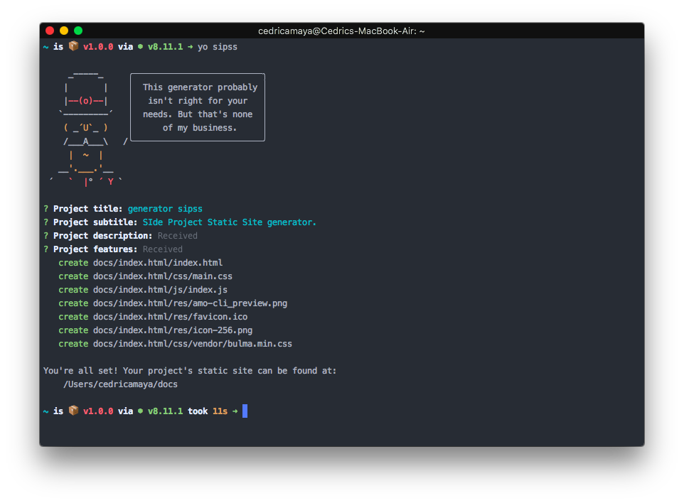

# generator-sipss

> Yeoman generator for scaffolding a SIde-Project Static Site (sipss).

<p align="center">
  
</p>

## Installation

First you need install [yeoman](http://yeoman.io/).

```sh
npm install -g yo
```

Then install the sipss generator.

```sh
npm install -g yo generator-sipss
```

## Usage

Generate your project's site and follow the prompts.

```sh
$ yo sipss
```

Once finished, you're all set! 🎉

`sipss` scaffolds a static site for an existing project, one usually hosted on GitHub. It will create a `/docs` folder containing the site files and resources which then enables you to host your project's newly-created site by enabling GitHub pages from the `/docs` folder in the `master` branch.

For more information on how to setup GitHub pages using this method, [refer to GitHub's documentation](https://help.github.com/articles/configuring-a-publishing-source-for-github-pages/#publishing-your-github-pages-site-from-a-docs-folder-on-your-master-branch).

## Background

The idea for `sipss` came from the need to simplify creating static sites for my side projects. As you can see from [this Twitter thread](https://twitter.com/CedricAmaya/status/997322163454525440), I found that each project's site was 95% the same as the others - all I was changing was the basics like the name of the project, its description, features, etc. So, I decided to make my life a little easier and create this Yeoman generator to scaffold the site for me.

> **Note:** this generator has a very specific use-case and probably will not suit your needs. That is, unless you want to make a site similar to https://cedric.tech/amo-cli or https://cedric.tech/should-i-cli. But that's none of my business 🐸🍵

## License

[MIT License](LICENSE.md)